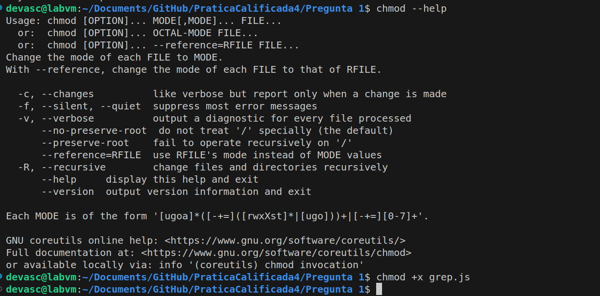
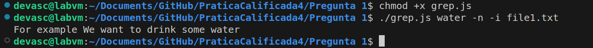
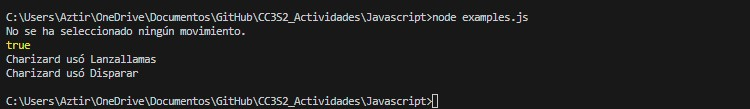

# Practica Calificada 4
### Alumna:Zuñiga Chicaña Alejandra Aztirma 
### Codigo: 20202142E

## Pregunta 1

Se nos pide implementar un comando grep simplificado que admita la busqueda de cadenas fijas, para ello crearemos un archivo llamado grep.js que contenga las siguientes lineas:

```
grep.js
```
Este ejemplo buscará la cadena `searchString` en los archivos `file1.txt` y `file2.txt`, mostrando el número de línea (`-n`) e ignorando mayúsculas y minúsculas (`-i`). 

```javascript
#!/usr/bin/env node

const fs = require('fs');
const args = process.argv.slice(2);

function grep(searchString, flags, files) {
  const regex = new RegExp(searchString, flags.includes('i') ? 'i' : '');

  files.forEach((file) => {
    const content = fs.readFileSync(file, 'utf-8').split('\n');

    for (let i = 0; i < content.length; i++) {
      const line = content[i];
      const match = regex.test(line);

      if ((flags.includes('v') && !match) || (!flags.includes('v') && match)) {
        let output = '';
        if (files.length > 1) {
          output += `${file}:`;
        }
        if (flags.includes('n')) {
          output += `${i + 1}:`;
        }
        output += `${line}`;
        console.log(output);
      }
    }
  });
}

const searchString = args.shift();
const flags = args.filter(arg => arg.startsWith('-'));
const files = args.filter(arg => !arg.startsWith('-'));

grep(searchString, flags, files);
```

Guardamos este código en un archivo llamado `grep.js` y nos aseguramos de darle permisos de ejecución:

```bash
chmod +x grep.js
```

Luego podemos usarlo de la siguiente manera:

```bash
./grep.js searchString -n -i file1.txt
```
Al realizar este comando vemos que no tenemos salida alguno puesto que no se ha encontrado la cadena `searchString` en el archivo `file1.txt`.



Ahora por ello vamos a crear los archivos de texto para poder verificar la funcionalidad de nuestro código, dicho archivo de texto contiene lo siguiente:

```
This is an example
It contains some words
For example We want to drink some water
```
Para poder verificar que el archivo de texto contiene la palabra "water" se debe usar el comando `grep`:



Como se observa se encontro la cadena mencionada y se obtuvo como salida la linea de nuestro archivo de texto que contenia la palabra "water" en este caso.


## Pregunta 2

En este ejercicio, se crearon dos archivos principales: `pokemon.js` y `examples.js`, para implementar la funcionalidad de las clases "Pokemon" y "Charizard" en JavaScript.

### Archivo `pokemon.js`:

Este archivo contiene la definición de las clases `Pokemon` y `Charizard`. Aquí hay una breve descripción de cada clase:

- **Clase `Pokemon`:**
  - Representa a un Pokémon genérico con propiedades como puntos de salud (`HP`), ataque (`ataque`), defensa (`defensa`), movimiento (`movimiento`), nivel (`nivel`) y tipo (`tipo`).
  - Ofrece métodos como `fight()` que verifica si se ha seleccionado algún movimiento y `canFly()` que verifica si el Pokémon puede volar.
  
- **Clase `Charizard`:**
  - Hereda de la clase `Pokemon` y representa a Charizard.
  - Agrega un constructor que configura específicamente el movimiento y el tipo de Charizard.
  - Sobreescribe el método `fight()` para personalizar la lógica de combate de Charizard.

### Archivo `examples.js`:

Este archivo contiene ejemplos de uso de las clases definidas en `pokemon.js`. Se crean instancias de Pokémon y Charizard, y se realizan diversas operaciones para ilustrar las funcionalidades de las clases. Algunos ejemplos incluyen la validación de movimientos, la comprobación de tipos y la realización de acciones específicas de Charizard.

En el archivo `examples.js`, se proporcionan cinco ejemplos que ilustran el uso de las clases `Pokemon` y `Charizard`:

1. **Ejemplo 1:**
   - Creación de un Pokemon sin movimiento y tipo.
   - Debería lanzar un error indicando "No se ha seleccionado ningún movimiento."

2. **Ejemplo 2:**
   - Creación de un Pokemon con movimiento y tipo "Volar".
   - Debería imprimir `true`, indicando que el Pokemon puede volar.

3. **Ejemplo 3:**
   - Creación de un Charizard sin movimiento.
   - Debería lanzar un error indicando "No se ha seleccionado ningún movimiento."

4. **Ejemplo 4:**
   - Creación de un Charizard con movimiento personalizado ("Lanzallamas").
   - Debería imprimir "Charizard usó Lanzallamas."

5. **Ejemplo 5:**
   - Creación de un Charizard sin especificar un movimiento (utilizando el movimiento por defecto "Disparar").
   - Debería imprimir "Charizard usó Disparar."

Se puede comprobar lo expuesto con la siguiente salida de la ejecucion del archivo `examples.js`



## Pregunta 3

El problema con el enfoque dado es que la clase `CurrentDay` instancia directamente la clase `MonthlySchedule` dentro de su método `initialize`. Esto crea una dependencia fuerte y acoplada entre `CurrentDay` y `MonthlySchedule`, lo que dificulta la prueba del método `workday?`. La dependencia directa hace que sea difícil realizar pruebas unitarias efectivas, ya que no puedes aislar la lógica de `workday?` de la implementación de `MonthlySchedule`.

Modificaremos el código para aplicar la inyección de dependencia y hacer que `MonthlySchedule` sea una dependencia externa pasada como argumento al constructor de `CurrentDay`:

```ruby
class CurrentDay
  def initialize(schedule)
    @date = Date.today
    @schedule = schedule
  end

  def work_hours
    @schedule.work_hours_for(@date)
  end

  def workday?
    !@schedule.holidays.include?(@date)
  end
end
```

Ahora, para instanciar `CurrentDay`, necesitaremos pasar una instancia de `MonthlySchedule` al constructor:

Esto de aquí, suponiendo que ya tenemos una instancia de MonthlySchedule creada, creamos una instancia de CurrentDay con inyección de dependencia y luego llamamos a los métodos:

```ruby
monthly_schedule = MonthlySchedule.new(2020, 12)

current_day = CurrentDay.new(monthly_schedule)

puts current_day.work_hours
puts current_day.workday?
```
Para realizar pruebas unitarias y cambiar la fecha actual solo para las pruebas, haremos lo siguiente:

```ruby
before do
  Date.singleton_class.class_eval do
    alias_method :_today, :today
    define_method(:today) { Date.new(2020, 12, 16) }
  end
end

after do
  Date.singleton_class.class_eval do
    alias_method :today, :_today
    remove_method :_today
  end
end
```
Esto cambiará temporalmente el comportamiento del método `today` de `Date` solo durante las pruebas y luego lo restaurará después de las pruebas.

**¿Qué sucede en JavaScript con el DIP en este ejemplo?**
En JavaScript, se puede  aplicar DIP mediante la inyección de dependencias y utilizando interfaces o clases abstractas para definir contratos. Sin embargo, la aplicación concreta del DIP puede variar según la estructura y el diseño del código, para este ejemplo ... 

## Pregunta 4

Este inciso contiene varias preguntas dentro de ello, gran parte de ellas son actividades propuestas en clase, es por ello que se dara respuesta a cada uno de ellas, implementando lo solicitado en cada caso y como evidencia screenshot de los fragmentos de codigo.


### Pregunta 4.1
Esta sección nos pide utilizar el repositorio y las actividades que has hemos desarrollado enIntroducción a Rails.

a. Modifica la vista Index para incluir el número de fila de cada fila en la tabla de películas.  


b. Modifica la vista Index para que cuando se sitúe el ratón sobre una fila de la tabla, dicha 
fila cambie temporalmente su color de fondo a amarillo u otro color.  


c. Modifica la acción Index del controlador para que devuelva las películas ordenadas 
alfabéticamente por título, en vez de por fecha de lanzamiento. 

d. Modifique la acción Index del controlador para que devuelva las películas ordenadas alfabéticamente por título. Utiliza el método sort del módulo Enumerable de Ruby
